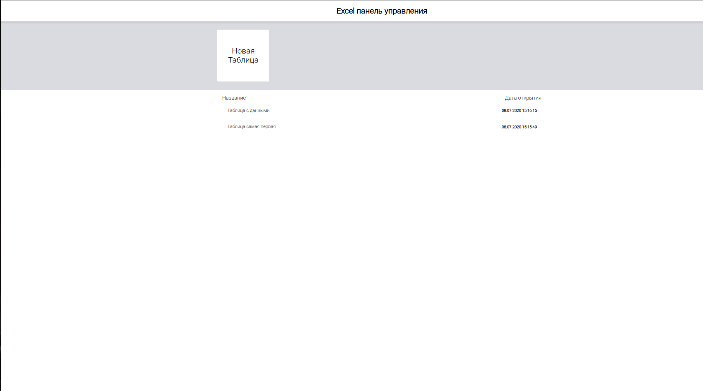
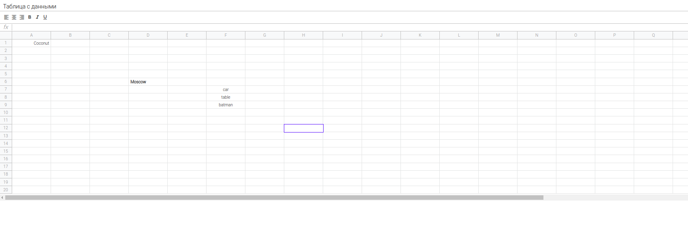
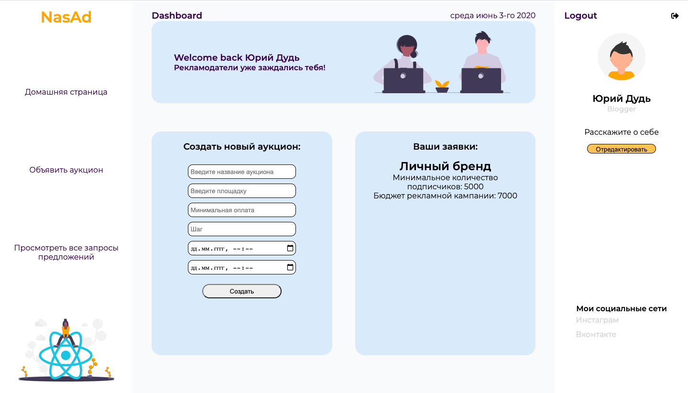
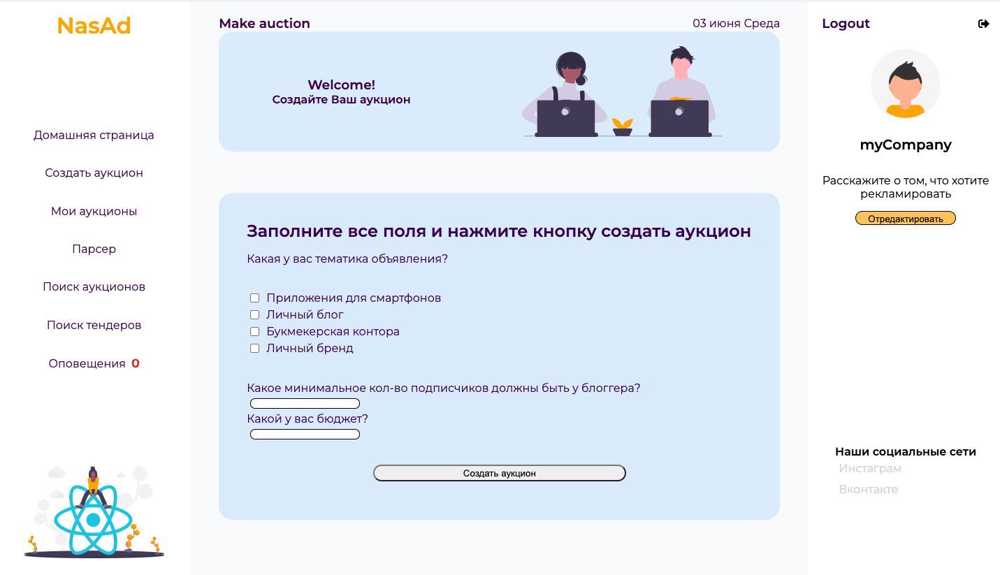
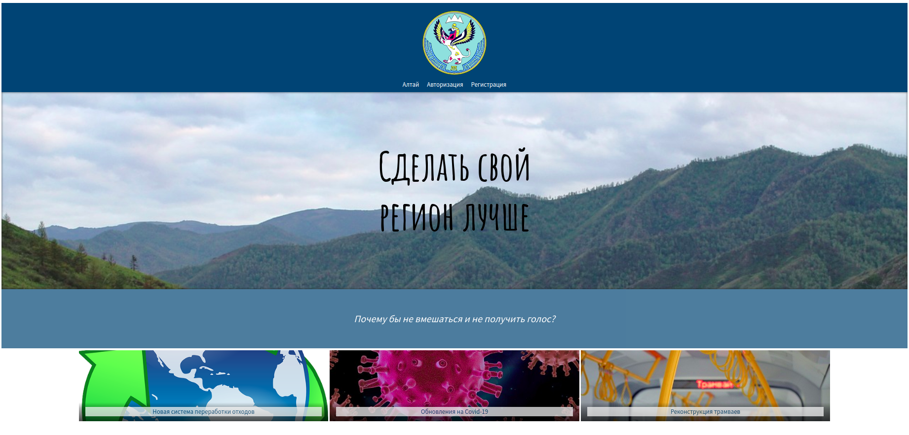
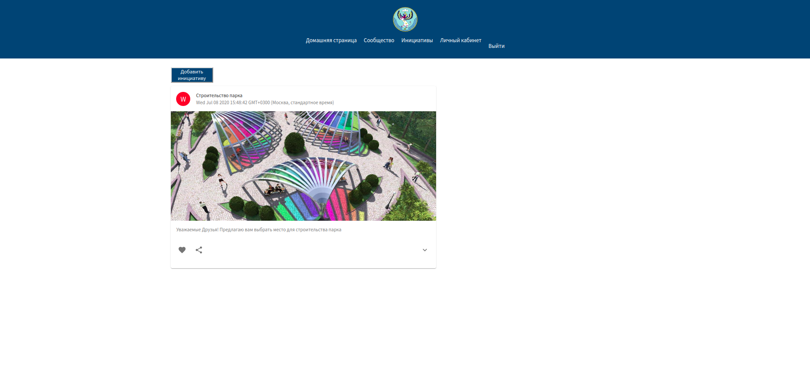
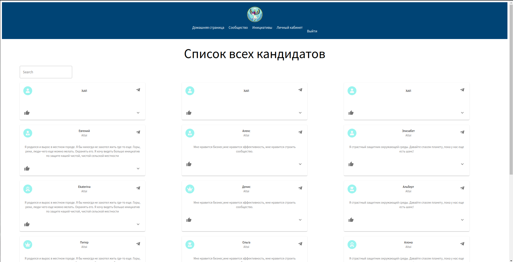

# Моё портфолио!

**Excel(pet project)** – Аналог всем известного Microsoft Excel выполненный на чистом на JavaScript

https://github.com/XaVi7777/excel

  #### В приложении доступен функционал:

  + Главная страница со всеми созданными таблицами
  + Таблица по фунционалу схожая с Excel с возможностью заполнения, редактирования.
  + Сохранение и удаление таблиц

  ### Используемые технологии:

* JavaScript(ES2016)
* Webpack
* eslint-config-google
* HTML 5/ CSS 3 (SCSS)

### Как это выглядит:

  

  ____
  

## NasAd - сервис для организации закупки рекламы у блогеров.

https://github.com/XaVi7777/NasAd

  Приложние позволяет регистрироваться как организациям так и блогерам. 
  #### Для организаций доступен функционал:

  + Участие в аукционах
  + Поиск по объявленным аукционам
  + Создание запросов предложений

#### Для блогеров доступен функционал:

  + Создание аукционов 
  + Отслеживание запросов на закупку рекламы
  + Отслеживание хода торгов в реальном времени

  ### Используемые технологии:
Фронт приложения реализован при помощи:

* React/ Redux / Thunk
* HTML 5/ CSS 3

Бэк:

* Node.js, Express
* MongoDB, mongoose
* WebSockets

### Как это выглядит:

  

  ____
  

  ____
  

  ____
  

## dALT - MVP сервиса по выявлению лидеров мнений республики Алтай, реализованное в течение 36 часового хакатона Цифровой прорыв 2020.

https://github.com/negomi-e/altai

  Приложние позволяет регистрироваться как организациям так и блогерам. 

#### Для пользователей доступен функционал:

  + Регистрация на платформе
  + Создание и заполнение информации о себе
  + Создание и просмотр инициатив
  + Голосование за понравившиеся инициативы

### Используемые технологии:

* React JS
* React hooks
* Redux
* node.js
* Express
* Materialize UI
* CSS
* HTML
* MongoDB
* Mongoose

### Команда:

* [Imogen Eddings]
* [Ivan Kursakov]
* [Dmitry Pak]
* [Adgem]
* [Maxim Gabrielov]

### Как это выглядит:

  

  ____
  

  ____
  

  ____
  

## EasyParking - SSR приложение отслеживания ближайших парковок.

Приложение решает проблему поиска близлежащих парковок. 

https://github.com/XaVi7777/easyparking

  Приложние позволяет регистрироваться как организациям так и блогерам. 
  #### Для организаций доступен функционал:

  + Создание парковки.
  + Редактирование удаление парковки.

#### Для пользователей доступен функционал:

  + Карта с выводом всех парковок
  + Возможность забронировать место на парковке

### Используемые технологии:

* Node.js, Express
* MongoDB, mongoose
* Handlebars
* Yandex.maps API
